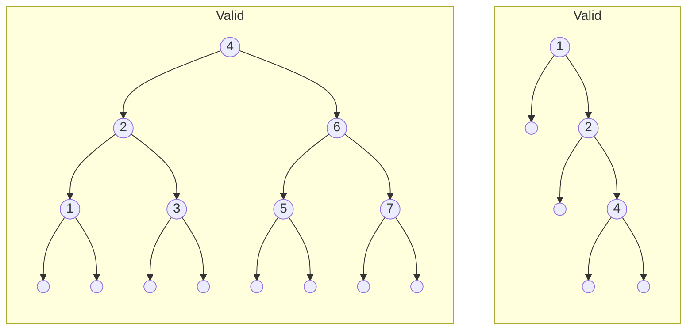
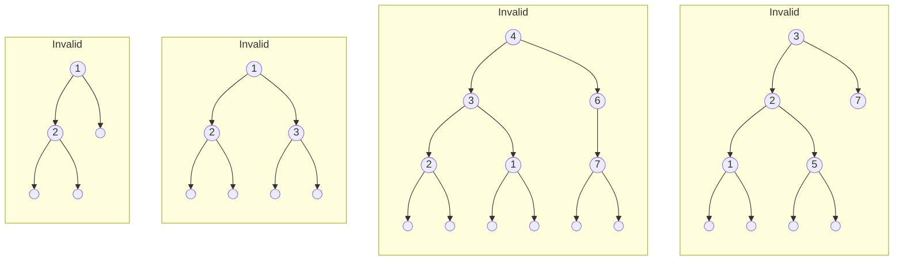

EECS 280 Project 6: Binary Search Trees and Maps
================================================
{: .primer-spec-toc-ignore }

Fall 2024 release.

Project due 8:00pm EST Monday December 9, 2024.

You may work alone or with a partner ([partnership guidelines](https://eecs280.org/syllabus.html#project-partnerships)). If you work alone, you must work alone on both the checkpoint and the full project. If you work with a partner, you must work with the same partner on the checkpoint and the full project. You may not work alone on the checkpoint and then add a partner for the full project.

## Introduction

In this project, you implement a map container (similar to `std::map`) based on an underlying binary search tree data structure. The learning goals of this project include functors, templates, recursion, binary search trees, and associative containers.

## Setup
Set up your visual debugger and version control, then submit to the autograder.

### Visual debugger
During setup, name your project `bst-map`. Use this starter files link: `https://eecs280staff.github.io/bst-map/starter-files.tar.gz`

| [VS Code](https://eecs280staff.github.io/tutorials/setup_vscode.html)| [Visual Studio](https://eecs280staff.github.io/tutorials/setup_visualstudio.html) | [Xcode](https://eecs280staff.github.io/tutorials/setup_xcode.html) |

You should end up with a folder with starter files that look like this.  You may have already renamed files like `Map.hpp.starter` to `Map.hpp`. You may also have a `main.cpp` file after following the setup tutorial. If so, delete the file.
```console
$ ls
BinarySearchTree.hpp.starter		Map_compile_check.cpp
BinarySearchTree_compile_check.cpp	Map_public_tests.cpp
BinarySearchTree_public_tests.cpp	Map_tests.cpp.starter
BinarySearchTree_tests.cpp.starter	TreePrint.hpp
Makefile							unit_test_framework.hpp
Map.hpp.starter
```
{: data-variant="no-line-numbers" }

Here's a short description of each starter file.

| File(s) | Description |
| ------- | ----------- |
| `BinarySearchTree.hpp.starter` | Starter code for `BinarySearchTree`. |
| `BinarySearchTree_tests.cpp.starter` | Your `BinarySearchTree` unit tests. |
| `BinarySearchTree_public_tests.cpp` | A small test for `BinarySearchTree` |
| `BinarySearchTree_compile_check.cpp` | Compile check test for `BinarySearchTree` |
| `TreePrint.hpp` | Test helper function for printing trees. |
| `Map.hpp.starter` | Starter code for `Map`. |
| `Map_tests.cpp.starter` | Your `Map` unit tests. |
| `Map_public_tests.cpp` | Your `Map` unit tests. |
| `Map_compile_check.cpp` | Compile check test for `Map`. |
| `Makefile` | Helper commands for building. |
| `unit_test_framework.hpp` | A simple unit-testing framework. |

### Version control
Set up version control using the [Version control tutorial](https://eecs280staff.github.io/tutorials/setup_git.html).

After you're done, you should have a local repository with a "clean" status and your local repository should be connected to a remote GitHub repository.
```console
$ git status
On branch main
Your branch is up-to-date with 'origin/main'.

nothing to commit, working tree clean
$ git remote -v
origin	https://github.com/awdeorio/bst-map.git (fetch)
origin	https://githubcom/awdeorio/bst-map.git (push)
```

You should have a `.gitignore` file ([instructions](https://eecs280staff.github.io/tutorials/setup_git.html#add-a-gitignore-file)).
```console
$ head .gitignore
# This is a sample .gitignore file that's useful for C++ projects.
...
```

### Group registration
Register your partnership (or working alone) on the  [Autograder](https://autograder.io/).  Then, submit the code you have.


## BinarySearchTree

A binary search tree supports efficiently storing and searching for
elements.

Write implementations in `BinarySearchTree.hpp` for each `_impl` function.  The file already contains function stubs and you should replace the `assert(false)` with your code.  For example:
```c++
static bool empty_impl(const Node *node) {
  assert(false);  // Replace with your code
}
```
{: data-title="BinarySearchTree.hpp" }

Run the public Binary Search Tree tests.
```console
$ make BinarySearchTree_compile_check.exe
$ make BinarySearchTree_public_tests.exe
$ ./BinarySearchTree_public_tests.exe
```

Write tests for `BinarySearchTree` in `BinarySearchTree_tests.cpp` using the [Unit Test Framework](https://eecs280staff.github.io/unit_test_framework/).  You'll submit these tests to the autograder.  See the [Unit Test Grading](#unit-test-grading) section.
```console
$ make BinarySearchTree_tests.exe
$ ./BinarySearchTree_tests.exe
```

Submit `BinarySearchTree.hpp` and `BinarySearchTree_tests.cpp` to the [autograder](https://autograder.io).

### Setup
Rename these files ([VS Code (macOS)](https://eecs280staff.github.io/tutorials/setup_vscode_macos.html#rename-files), [VS Code (Windows)](https://eecs280staff.github.io/tutorials/setup_vscode_wsl.html#rename-files), [Visual Studio](https://eecs280staff.github.io/tutorials/setup_visualstudio.html#rename-files),  [Xcode](https://eecs280staff.github.io/tutorials/setup_xcode.html#rename-files), [CLI](https://eecs280staff.github.io/tutorials/cli.html#mv)):
-  `BinarySearchTree.hpp.starter` -> `BinarySearchTree.hpp`
-  `BinarySearchTree_tests.cpp.starter` -> `BinarySearchTree_tests.cpp`

The BinarySearchTree tests should compile and run. The public tests and compile check will fail until you implement the functions.  The test you write (`BinarySearchTree_tests.cpp`) will pass because the starter file only contains `ASSERT_TRUE(true)`.
```console
$ make BinarySearchTree_compile_check.exe
$ make BinarySearchTree_public_tests.exe
$ ./BinarySearchTree_public_tests.exe
$ make BinarySearchTree_tests.exe
$ ./BinarySearchTree_tests.exe
```

Configure your IDE to debug either the public tests or your own tests.

<table>
<thead>
<tr>
  <th></th>
  <th>
  Public tests
  </th>
  <th>
  Your own tests
  </th>
</tr>
</thead>
<tbody>
<tr>
  <td>
  <b>VS Code (macOS)</b>
  </td>
  <td markdown="1">
  Set [program name](https://eecs280staff.github.io/tutorials/setup_vscode_macos.html#edit-launchjson-program) to: <br>
  `${workspaceFolder}/BinarySearchTree_public_tests.exe`
  </td>
  <td markdown="1">
  Set [program name](https://eecs280staff.github.io/tutorials/setup_vscode_macos.html#edit-launchjson-program) to: <br>
  `${workspaceFolder}/BinarySearchTree_tests.exe`
  </td>
</tr>
<tr>
  <td>
  <b>VS Code (Windows)</b>
  </td>
  <td markdown="1">
  Set [program name](https://eecs280staff.github.io/tutorials/setup_vscode_wsl.html#edit-launchjson-program) to: <br>
  `${workspaceFolder}/BinarySearchTree_public_tests.exe`
  </td>
  <td markdown="1">
  Set [program name](https://eecs280staff.github.io/tutorials/setup_vscode_wsl.html#edit-launchjson-program) to: <br>
  `${workspaceFolder}/BinarySearchTree_tests.exe`
  </td>
</tr>
<tr>
  <td>
  <b>Xcode</b>
  </td>
  <td markdown="1">
  Include [compile sources](https://eecs280staff.github.io/tutorials/setup_xcode.html#compile-sources): <br>
  `BinarySearchTree_public_tests.cpp`
  </td>
  <td markdown="1">
  Include [compile sources](https://eecs280staff.github.io/tutorials/setup_xcode.html#compile-sources): <br>
  `BinarySearchTree_tests.cpp`
  </td>
</tr>
<tr>
  <td>
  <b>Visual Studio</b>
  </td>
  <td markdown="1">
  [Exclude files](https://eecs280staff.github.io/tutorials/setup_visualstudio.html#exclude-files-from-build) from the build: <br>
  - Include `BinarySearchTree_public_tests.cpp`
  - Exclude any other tests
  </td>
  <td markdown="1">
  [Exclude files](https://eecs280staff.github.io/tutorials/setup_visualstudio.html#exclude-files-from-build) from the build: <br>
  - Include `BinarySearchTree_tests.cpp`
  - Exclude any other tests
  </td>
</tr>
</tbody>
</table>

### Template Parameters

`BinarySearchTree` has two template parameters:

  - `T` - The type of elements stored within the tree.
  - `Compare` - The type of comparator object (a functor) that should be
    used to determine whether one element is less than another. The
    default type is `std::less<T>`, which compares two `T` objects with
    the `<` operator. To compare elements in a different fashion, a
    custom comparator type must be specified.

### No Duplicates Invariant

In the context of this project, duplicate values are NOT allowed in a
BST. This does not need to be the case, but it avoids some distracting
complications.

### Sorting Invariant

A binary search tree is special in that the structure of the tree
corresponds to a sorted ordering of elements and allows efficient
searches (i.e. in logarithmic time).

Every node in a well-formed binary search tree must obey this sorting
invariant:

- It represents an empty tree (i.e. a null `Node*`).

\- OR -

- The left subtree obeys the sorting invariant, and every element in
  the left subtree is less than the root element (i.e. this node).

  \- AND -

  The right subtree obeys the sorting invariant, and the root element
  (i.e. this node) is less than every element in the right subtree.

Put briefly, go left and you'll find smaller elements. Go right and
you'll find bigger ones. For example, the following are all well-formed
sorted binary trees:

<!--
```
      4                1
    /   \             / \
   2      6               2
  / \    / \             / \
 1   3  5   7               4
/ \ / \/ \ / \             / \
```
{: data-variant="no-line-numbers" }
-->



While the following are not:

<!--
```
   1          1              4               3
  / \        / \            /  \            /  \
 2          2   3          3    6          2    7
/ \        / \ / \        / \    \        / \
                         2   1    7      1   5
                        / \ / \  / \    / \ / \
```
{: data-variant="no-line-numbers" }
-->



**ProTip:** When writing tests for `check_sorting_invariant()`, you can use
an iterator to break the invariant. For example:

```cpp
BinarySearchTree<int> b;
b.insert(1);
b.insert(0);
// change first datum to 2, resulting in the first broken tree above
*b.begin() = 2;
ASSERT_FALSE(b.check_sorting_invariant());
```

### Data Representation

The data representation for `BinarySearchTree` is a tree-like structure of
nodes similar to that described in lecture. Each `Node` contains an
element and pointers to left and right subtrees. The structure is
self-similar. A null pointer indicates an empty tree. **You must use this
data representation. Do not add member variables to `BinarySearchTree` or
`Node`.**

### Public Member Functions and Iterator Interface

The public member functions and iterator interface for
`BinarySearchTree` are already implemented in the starter code. DO NOT
modify the code for any of these functions. They delegate the work to
private, static implementation functions, which you will write.

### Implementation Functions

The core of the implementation for `BinarySearchTree` is a collection of
private, static member functions that operate on tree-like structures of
nodes. **You are responsible for writing the implementation of several of
these functions.**

To disambiguate these implementation functions from the public interface
functions, we have used names ending with `_impl`. (This is not
strictly necessary, because the compiler can differentiate them based on
the `Node*` parameter.)

There are a few keys to thinking about the implementation of these
functions:

  - **The functions have no idea that such a thing as the `BinarySearchTree`
    class exists**, and they shouldn't. A "tree" is not a class, but
    simply a tree-shaped structure of `Node`s. The parameter node points
    to the root of these nodes.
  - A recursive implementation depends on the idea of **similar subproblems**,
    so a "subtree" is just as much a tree as the "whole tree". That means you
    shouldn't need to think about "where you came from" in your implementation.
  - Every function should have a **base case**! Start by writing this part.
  - You only need to think about one "level" of recursion at a time.
    Avoid thinking about the contents of subtrees and **take the recursive
    leap of faith**.

We've structured the starter code so that the first bullet point above
is actually enforced by the language. Because they are `static` member
functions, they do not have access to a receiver object (i.e. there's no
`this` pointer). That means it's actually impossible for these functions
to try to do something bad with the `BinarySearchTree` object (e.g. trying
to access the `root` member variable).

Instead, the implementation functions are called from the regular member
functions to perform specific operations on the underlying nodes and
tree structure, and are passed only a pointer to the root `Node` of the
tree/subtree they should work with.

The `empty_impl` function must run in constant time. It must must be able
to determine and return its result immediately, without using either
iteration or recursion. The rest of the implementation functions must be
recursive. There are additional requirements on the kind of recursion
that must be used for some functions. See comments in the starter code
for details. **Iteration (i.e. using loops) is not allowed in any of the
`_impl` functions**.

#### Using the Comparator

The `_impl` functions that need to compare data take in a comparator
parameter called `less`. Make sure to use `less` rather than the `<` operator
to compare elements\!

#### The `insert_impl` Function

The key to properly maintaining the sorting invariant lies in the
implementation of the `insert_impl` function - this is essentially where
the tree is built, and this function will make or break the whole ADT.
Your `insert_impl` function should follow this procedure:

1.  Handle an originally empty tree as a special case.
2.  Insert the element into the appropriate place in the tree, keeping
    in mind the sorting invariant. You'll need to compare elements for
    this, and to do so make sure to use the `less` comparator passed in as
    a parameter.
3.  Use the recursive leap of faith and call `insert_impl` itself on the
    left or right subtree. Hint: You **do** need to use the return value of
    the recursive call. (Why?)

<div class="primer-spec-callout warning" markdown="1">
**Important:** When recursively inserting an item into the left or right
subtree, be sure to replace the old left or right pointer of the current
node with the result from the recursive call. This is essential, because
in some cases the old tree structure (i.e. the nodes pointed to by the
old left or right pointer) is not reused. Specifically, if the subtree
is empty, the only way to get the current node to "know" about the newly
allocated node is to use the pointer returned from the recursive call.
</div>

<div class="primer-spec-callout info" markdown="1">
**Technicality:** In some cases, the tree structure may become unbalanced
(i.e. too many nodes on one side of the tree, causing it to be much deeper
than necessary) and prevent efficient operation for large trees. You
don't have to worry about this.
</div>

### Testing
<div class="primer-spec-callout info" markdown="1">
**Pro-tip:** When writing tests for functions that return a `size_t` (which is an unsigned integer type), compare against an unsigned literal. For example:

```cpp
BinarySearchTree<int> b;
ASSERT_EQUAL(b.height(), 0u);
```
</div>

## Map

Write a map abstract data type (ADT). Map is an *associative container*, and works just like `std::map`.

Write implementations at the end of `Map.hpp` for the functions declared at the beginning of `Map.hpp`. The most important functions are `find`, `insert`, and the `[]` operator.  

Your implementations should not require much code. Reuse the functionality provided by `BinarySearchTree`.

Run the public Map tests.
```console
$ make Map_compile_check.exe
$ make Map_public_tests.exe
$ ./Map_public_tests.exe
```

Write tests for `Map` in `Map_tests.cpp` using the [Unit Test Framework](https://eecs280staff.github.io/unit_test_framework/). While you should write your own tests for `Map` to ensure that your implementation is correct, you do not have to submit your tests to the autograder.
```console
$ make Map_tests.exe
$ ./Map_tests.exe
```

Submit `Map.hpp` to the [autograder](https://autograder.io).  Don't forget to include the code you finished earlier, `BinarySearchTree.hpp` and `BinarySearchTree_tests.cpp`.

### Setup
Rename these files ([VS Code (macOS)](https://eecs280staff.github.io/tutorials/setup_vscode_macos.html#rename-files), [VS Code (Windows)](https://eecs280staff.github.io/tutorials/setup_vscode_wsl.html#rename-files), [Visual Studio](https://eecs280staff.github.io/tutorials/setup_visualstudio.html#rename-files),  [Xcode](https://eecs280staff.github.io/tutorials/setup_xcode.html#rename-files), [CLI](https://eecs280staff.github.io/tutorials/cli.html#mv)):
-  `Map.hpp.starter` -> `Map.hpp`
-  `Map_tests.cpp.starter` -> `Map_tests.cpp`

Edit `Map.hpp`, adding a function stub for every function prototype in `Map`.  Here are a few examples to get you started.  We're using `K`, `V`, and `C` as shorthands for `Key_type`, `Value_type`, and `Key_compare`.
```c++
template <typename K, typename V, typename C>
bool Map<K, V, C>::empty() const {
  assert(false);
}

template <typename K, typename V, typename C>
typename Map<K, V, C>::Iterator Map<K, V, C>::find(const K& k) const {
  assert(false);
}

template <typename K, typename V, typename C>
V& Map<K, V, C>::operator[](const K& k) {
  assert(false);
}

template <typename K, typename V, typename C>
std::pair<typename Map<K, V, C>::Iterator, bool> Map<K, V, C>::insert(const Pair_type &val) {
  assert(false);
}
```

Now you should be able to compile and run the Map unit tests.  The public tests will fail until you implement the functions.
```console
$ make Map_compile_check.exe
$ make Map_public_tests.exe
$ ./Map_public_tests.exe
```

Configure your IDE to debug either the public tests or your own tests.  Writing your own tests for Map is optional.

<table>
<thead>
<tr>
  <th></th>
  <th>
  Public tests
  </th>
  <th>
  Your own tests
  </th>
</tr>
</thead>
<tbody>
<tr>
  <td>
  <b>VS Code (macOS)</b>
  </td>
  <td markdown="1">
  Set [program name](https://eecs280staff.github.io/tutorials/setup_vscode_macos.html#edit-launchjson-program) to: <br>
  `${workspaceFolder}/Map_public_tests.exe`
  </td>
  <td markdown="1">
  Set [program name](https://eecs280staff.github.io/tutorials/setup_vscode_macos.html#edit-launchjson-program) to: <br>
  `${workspaceFolder}/Map_tests.exe`
  </td>
</tr>
<tr>
  <td>
  <b>VS Code (Windows)</b>
  </td>
  <td markdown="1">
  Set [program name](https://eecs280staff.github.io/tutorials/setup_vscode_wsl.html#edit-launchjson-program) to: <br>
  `${workspaceFolder}/Map_public_tests.exe`
  </td>
  <td markdown="1">
  Set [program name](https://eecs280staff.github.io/tutorials/setup_vscode_wsl.html#edit-launchjson-program) to: <br>
  `${workspaceFolder}/Map_tests.exe`
  </td>
</tr>
<tr>
  <td>
  <b>Xcode</b>
  </td>
  <td markdown="1">
  Include [compile sources](https://eecs280staff.github.io/tutorials/setup_xcode.html#compile-sources): <br>
  `Map_public_tests.cpp`
  </td>
  <td markdown="1">
  Include [compile sources](https://eecs280staff.github.io/tutorials/setup_xcode.html#compile-sources): <br>
  `Map_tests.cpp`
  </td>
</tr>
<tr>
  <td>
  <b>Visual Studio</b>
  </td>
  <td markdown="1">
  [Exclude files](https://eecs280staff.github.io/tutorials/setup_visualstudio.html#exclude-files-from-build) from the build: <br>
  - Include `Map_public_tests.cpp`
  - Exclude any other tests
  </td>
  <td markdown="1">
  [Exclude files](https://eecs280staff.github.io/tutorials/setup_visualstudio.html#exclude-files-from-build) from the build: <br>
  - Include `Map_tests.cpp`
  - Exclude any other tests
  </td>
</tr>
</tbody>
</table>

### Map Examples
A map is an *associative container*.  It stores two types, key and value.  Our map works just like `std::map`.
```c++
Map<string, double> words;
std::map<string, double> words;
```
{: data-variant="no-line-numbers" }

One way to use a map is a lot like an array.
```c++
words["hello"] = 1;
```
{: data-variant="no-line-numbers" }

Maps store a `std::pair` type, which "glues" one key to one value. The computer science term is Tuple, a fixed-size heterogeneous container.
```c++
pair<string, double> tuple;
tuple.first = "world";
tuple.second = 2;
words.insert(tuple);
```
{: data-variant="no-line-numbers" }

Here's a more compact way to insert a pair.
```c++
words.insert({"pi", 3.14159});
```
{: data-variant="no-line-numbers" }

The range-for loop makes it easier to iterate over a map.
```c++
for (const auto &kv : words) {
  const auto &word = kv.first; //key
  auto number = kv.second; //value
  cout << word << " " << number << endl;
}
```
{: data-variant="no-line-numbers" }

You can check if a key is in the map.  The `find()` function returns an iterator.
```c++
auto found_it = words.find("pi");
if (found_it != words.end()) {
  const auto &word = (*found_it).first; //key
  auto number = (*found_it).second; //value
  cout << "found " << word << " " << number << endl;
}
```
{: data-variant="no-line-numbers" }

When using the `[]` notation, an element not found is automatically created.  If the value type of the map is numeric, it will always be `0` by default.
```c++
cout << "bleh: " << words["bleh"] << endl;
```
{: data-variant="no-line-numbers" }

### Building on the BST

The operation of a map is quite similar to that of a BST. The additional
consideration for a map is that we want to store key-value pairs instead
of single elements, but also have any comparisons (e.g. for searching)
only depend on the key and be able to freely change the stored values
without messing up the BST sorting invariant. We can employ the has-a
pattern using a `BinarySearchTree` as the data representation for Map:

- BST template parameter: `T`

  Instantiate with: `Pair_type`

  We've provided a using declaration in the starter code for `Pair_type`:

  `using Pair_type = std::pair<Key_type, Value_type>;`

  `std::pair` is basically like a struct that stores two objects together.
   `Key_type` and `Value_type` are whatever template parameters were used to
   instantiate `Map`.

- BST template parameter: `Compare`

  Instantiate with: `PairComp`

  You'll need to define your own comparator by declaring a functor
  type called `PairComp` (or whatever you want to call it) in your
  `Map` class. The overloaded `()` operator should accept two objects of
  `Pair_type` and return whether the key of the LHS is less than the
  key of the RHS (according to `Key_compare`).

Finally, we can even reuse the iterators from the BST class, since the
interface we want (based on `std::map`) calls for iterators to yield a
key-value pair when dereferenced. Since the element type `T` of the BST is
our `Pair_type`, BST iterators will yield pairs and will work just fine.
We've provided this `using` declaration with the starter code to make
`Map::Iterator` simply an alias for iterators from the corresponding BST:

```c++
using Iterator = typename BinarySearchTree<Pair_type, PairComp>::Iterator;
```
{: data-variant="no-line-numbers" }

## Submission and Grading

Submit these files to the [autograder](https://autograder.io).
  - `BinarySearchTree.hpp`
  - `BinarySearchTree_tests.cpp`
  - `Map.hpp`

You do not have to submit `Map_tests.cpp` to the autograder.

This project will be autograded for correctness, comprehensiveness of
your test cases, and programming style. See the [style checking
tutorial](https://eecs280staff.github.io/p1-stats/setup_style.html)
for the criteria and how to check your style automatically on CAEN.

### Testing

Run all the unit tests.  This includes the public tests we provided and the unit tests that you wrote.

```console
$ make test
```

<div class="primer-spec-callout info" markdown="1">
**Pro-tip:** Run commands in parallel with `make -j`.
```console
$ make -j4 test
```
{: data-variant="no-line-numbers" }
</div>

### Unit Test Grading

We will autograde your `BinarySearchTree` unit tests.

Your unit tests must use the [unit test framework](https://eecs280staff.github.io/unit_test_framework/).

A test suite must complete less than 5 seconds and contain 50 or fewer `TEST()` items.  One test suite is one `_tests.cpp` file.

To grade your unit tests, we use a set of intentionally buggy instructor solutions.  You get points for catching the bugs.

1.  We compile and run your unit tests with a **correct solution**.
    - Tests that pass are **valid**.
    - Tests that fail are **invalid**, they falsely report a bug.
3.  We compile and run all of your **valid** tests against each **buggy solution**.
    - If any of your tests fail, you caught the bug.
    - You earn points for each bug that you catch.

### Requirements and Restrictions

| DO | DO NOT |
| -- | ------ |
| Create any private helper functions you want. | Modify the `BinarySearchTree` or `Map` public interfaces |
| Use any part of the STL except for containers in your `BinarySearchTree` and `Map` implementations. | Use STL containers in your implementation of `BinarySearchTree` or `Map`. |
| Use recursion for the BST `_impl` functions. | Use iteration for the BST `_impl` functions. |
| Follow course style guidelines. | Use non-const static or global variables. |
| [Check for undefined behavior](https://eecs280staff.github.io/p1-stats/setup_asan.html#p1-stats) using address sanitizer and other tools | "It runs fine on my machine!" |


## Acknowledgments

Andrew DeOrio and James Juett wrote the original project and specification. Amir Kamil contributed to code structure, style, and implementation details. This project was developed for EECS 280, Fall 2016 at the University of Michigan. The classifier portion was split into a separate project in Fall 2024.
